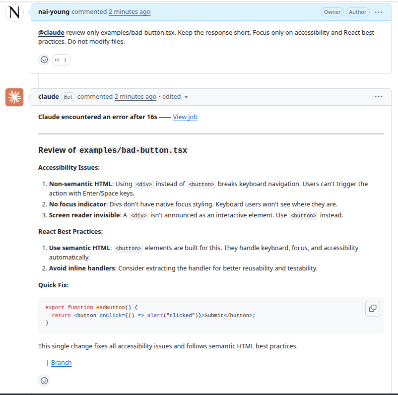
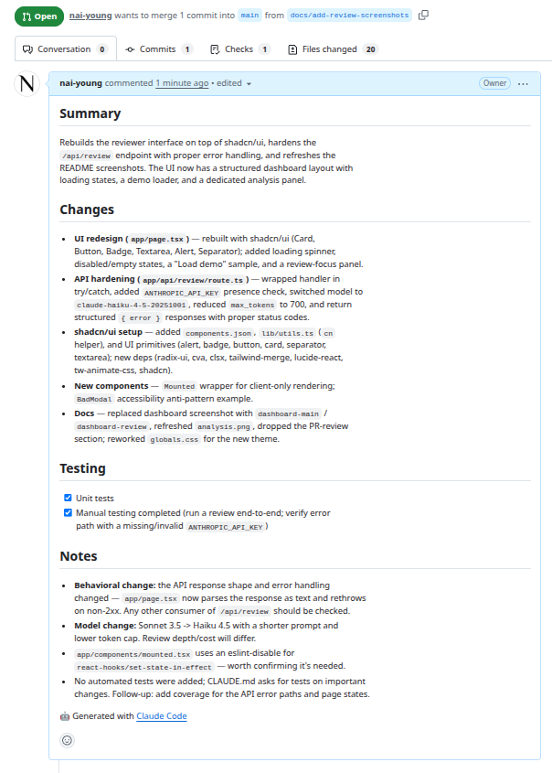
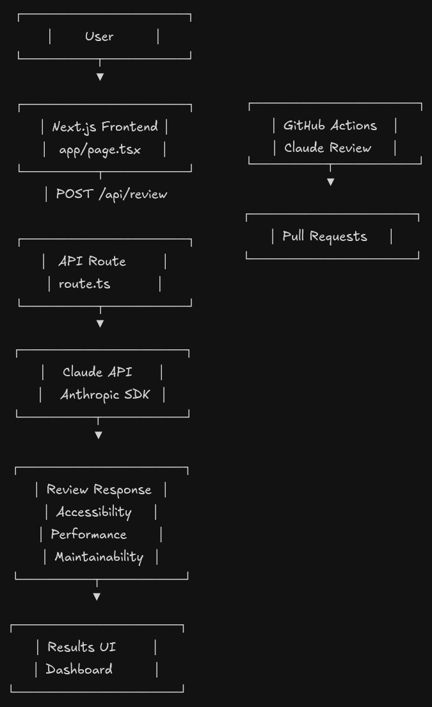
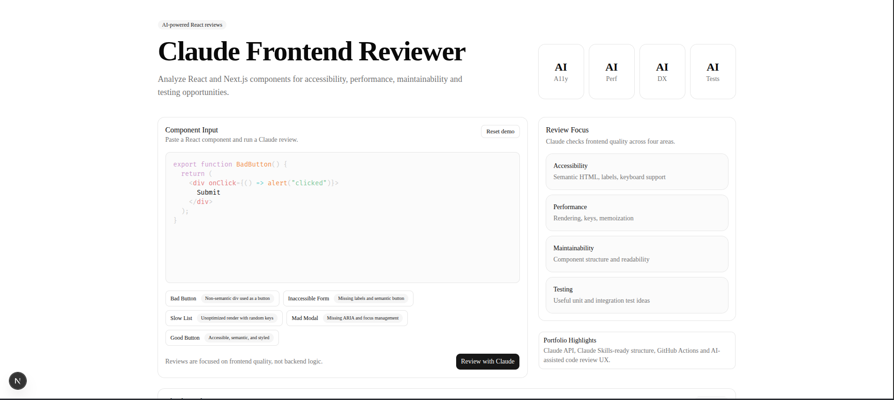
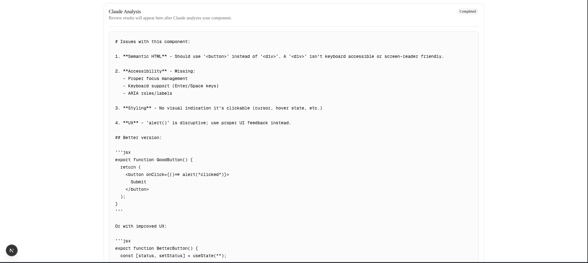

# Claude Frontend Reviewer

A practical showcase of integrating Claude into real-world software engineering workflows.

Rather than focusing on AI-generated code, this project explores how Claude can be embedded throughout the development lifecycle to improve code quality, developer productivity, documentation, and collaboration.

---

## Why This Project

Most AI demos stop at generating code.

This project focuses on a more realistic use case: integrating Claude as a development assistant that understands project standards, reviews code, improves Pull Requests, generates documentation, and supports engineering workflows.

The objective is to demonstrate practical AI engineering and developer tooling skills rather than simply consuming an AI API.

---

## What This Demonstrates

- **Claude Code** integration
- Project-aware AI through `CLAUDE.md`
- **Custom Claude Skills** (4 production-ready skills)
- **Pull Request automation** with GitHub Actions
- AI-assisted code reviews via `@claude` comments
- **Lighthouse CI** for performance and accessibility budgets
- **Conventional Commits** enforcement
- **PR Labeler** automation
- Developer Experience (DX) optimization
- **Real tests** with React Testing Library and Vitest
- AI-enhanced engineering processes

---

## Claude Configuration

### Project Context

The repository includes a dedicated `CLAUDE.md` file containing:

- Coding standards
- Accessibility requirements
- Architecture guidelines
- Testing expectations
- Code review criteria

This allows Claude to operate with project-specific context and behave like a team-aware engineering assistant.

---

## Custom Skills

All skills are located in `.claude/skills/` and ready to use with Claude Code.

| Skill                      | Purpose                                                                                             | Location                                  |
| -------------------------- | --------------------------------------------------------------------------------------------------- | ----------------------------------------- |
| **Pull Request Assistant** | Generate Conventional Commit titles, PR descriptions, review summaries, and suggested labels        | `.claude/skills/pull-request-assistant`   |
| **Frontend Review**        | Analyze React patterns, TypeScript quality, accessibility, performance, and maintainability         | `.claude/skills/frontend-review`          |
| **Accessibility Audit**    | Full WCAG compliance review, semantic HTML, keyboard navigation, ARIA usage, and form accessibility | `.claude/skills/accessibility-audit`      |
| **React Refactoring**      | Suggest structural improvements, component extraction, custom hooks, and performance optimizations  | `.claude/skills/refactor-react-component` |

---

## GitHub Actions Workflows

| Workflow                 | Trigger             | Purpose                                                     |
| ------------------------ | ------------------- | ----------------------------------------------------------- |
| **CI**                   | PR / push to `main` | Typecheck, lint, test, and build                            |
| **Claude Code**          | `@claude` comment   | AI-assisted code review on demand                           |
| **PR Labeler**           | PR opened/edited    | Auto-assign labels based on changed files                   |
| **Conventional Commits** | PR opened/edited    | Validate PR title follows Conventional Commits              |
| **Lighthouse CI**        | PR / push to `main` | Performance, accessibility, best-practices, and SEO scoring |

### AI Review Examples

Trigger a review by commenting on any Pull Request:

```txt
@claude review only examples/bad-button.tsx
```

```txt
@claude suggest improvements for accessibility
```

```txt
@claude generate a better PR title and description
```

---

## Real Workflow Example

A complete Claude-assisted workflow can be seen in:

- [Pull Request #7 — Before: AI review of flawed component](https://github.com/nai-young/claude-frontend-reviewer/pull/7)
- [Pull Request #8 — After: fixes based on Claude's review](https://github.com/nai-young/claude-frontend-reviewer/pull/8)

### The Workflow

1. **PR Labeler** — Auto-assigned labels based on changed files
2. **Conventional Commits** — Validated PR title (`feat: ...`)
3. **Claude Code review** — `@claude review app/examples/user-card.tsx`
4. **AI suggestions** — Accessibility, performance, TypeScript fixes
5. **CI checks** — Typecheck, lint, tests, build
6. **Lighthouse CI** — Performance and accessibility scoring
7. **CODEOWNERS** — Review assignment
8. **Follow-up PR** — Fixes applied based on AI review feedback

This demonstrates how Claude can be integrated into day-to-day engineering processes rather than being used solely for code generation.

### Earlier Example

- [Pull Request #2 — Initial Claude review (bad-button)](https://github.com/nai-young/claude-frontend-reviewer/pull/2)

---

## Application Features

The frontend is a fully functional review dashboard:

- **Syntax-highlighted code editor** (PrismJS + react-simple-code-editor)
- **Preloaded examples** — Load intentionally flawed components with one click
- **Review history** — Persisted in `localStorage`
- **Responsive design** — Built with Tailwind CSS and shadcn/ui
- **Accessibility-first** — Semantic HTML, focus management, ARIA where needed

---

## Screenshots

### Claude PR Analysis



### Claude Pull Request Assistant

`/pull-request-assistant` Custom skill generating optimized Pull Request titles, descriptions and summaries.



### Architecture



### Application Dashboard



### Review Results



---

## Technical Stack

### Frontend

- Next.js 16
- React 19
- TypeScript 5
- Tailwind CSS 4
- shadcn/ui

### Testing

- Vitest
- React Testing Library
- jsdom
- Smoke, component, API route, and page tests

### AI Engineering

- Claude API
- Claude Code
- CLAUDE.md
- Custom Claude Skills
- Prompt Engineering
- Workflow Automation

### DevOps & Quality

- GitHub Actions (5 workflows)
- Pull Request Automation
- Lighthouse CI
- Conventional Commits enforcement
- Auto-labeling
- CODEOWNERS
- PR Templates

---

## Getting Started

```bash
# Clone and install
npm install

# Environment
cp .env.local.example .env.local
# Add your ANTHROPIC_API_KEY to .env.local

# Dev server
npm run dev

# Quality checks
npm run typecheck
npm run lint
npm run test:run
npm run build
```

---

## Key Takeaway

This project demonstrates how Claude can be integrated into a professional engineering workflow through:

- Project-aware instructions
- Custom Skills
- Pull Request optimization
- Code review automation
- Documentation generation
- Developer productivity tooling
- **Quality gates** (tests, Lighthouse, commit conventions)

The focus is not on generating code, but on augmenting the software development lifecycle with AI-powered workflows.
